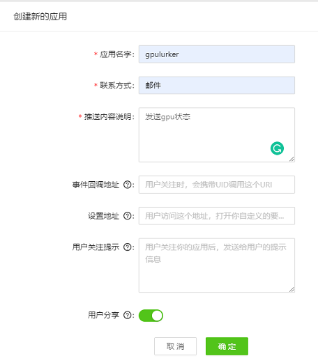

# gpu_lurker


服务器 GPU 监控程序，当 GPU 属性满足预设条件 (如至少 4 张卡的显存多于 1000M) 时通过微信发送提示消息。

## 安装

从 PyPI 上安装:

```bash
$ pip install --upgrade gpulurker
```

从 GitHub 上安装最新版本 (**推荐**):

```bash
$ pip install git+https://github.com/RenShuhuai-Andy/gpu_lurker.git#egg=gpulurker
```

或克隆该仓库手动安装:

```bash
$ git clone --depth=1 https://github.com/RenShuhuai-Andy/gpu_lurker.git
$ cd gpu_lurker
$ pip install .
```

## 使用

### 在WxPusher微信推送服务上注册并且创建应用
1. 进入[https://wxpusher.zjiecode.com/admin/login](https://wxpusher.zjiecode.com/admin/login)，使用微信扫码关注「新消息服务」公众号并完善信息。

2. 创建新的应用，创建成功后请保存好显示的 **APP_TOKEN**
<p align="center">
  
</p>

3. 微信扫码关注应用
<p align="center">
  
</p>

4. 进入「新消息服务」公众号，点击「我的」-「我的UID」获取 **UID**


### 在服务器上输入命令进行 GPU 监控

```bash
# 每隔 30 分钟检查服务器状态，当有 8 张卡，每张卡的显存多余 1000M 时，向微信发送提示消息
$ gpulurker -m 1000 -n 8 -f 30m
```

首次使用时需要输入自己的 **UID** 和 **APP_TOKEN**。

#### 主要参数

- `-m`, `--cuda-memory`: 每张卡所需的显存 (默认为 5000 MB)
- `-n`, `--device-num`: 所需的 GPU 数 (默认为 1 块)
- `-f`, `--check-freq`: 检查服务器状态的间隔时间，如1d (1天)，1h (1小时)，1m (1分钟)，1s (1秒)，1h30m (1小时30分钟) 等。默认为 10 分钟
- `-r`, `--reload`: 重新输入用户信息 (默认关闭)
- `-c`, `--continuous`: 满足条件时持续推送消息 (默认关闭)

键入 `ctrl+c` 终止监控。

键入 `gpulurker --help` 以获得更多信息:
```
usage: gpulurker [-h] [-m CUDA_MEMORY] [-n DEVICE_NUM] [-f CHECK_FREQ] [-r]
                 [--log_file LOG_FILE]

check if gpu is available and notify on your WeChat

optional arguments:
  -h, --help            show this help message and exit
  -m CUDA_MEMORY, --cuda-memory CUDA_MEMORY
                        Required CUDA memory per device
  -n DEVICE_NUM, --device-num DEVICE_NUM
                        Required number of devices
  -f CHECK_FREQ, --check-freq CHECK_FREQ
                        Frequency of inspection, eg. 10m (10 minutes)
  -r, --reload          Reload and update your appToken and uid
  -c, --continuous      Continue to push message when the conditions are met
  --log_file LOG_FILE   define the threshold of avaliable (in MB)
```

## Screenshots

## 致谢
本项目参考了以下仓库的代码：

- [check_gpu_usage_and_forward_wechat](https://github.com/mzy97/check_gpu_usage_and_forward_wechat)
- [nvitop](https://github.com/XuehaiPan/nvitop)

微信消息实时推送服务由 [WxPusher](https://github.com/wxpusher/wxpusher-client) 提供。
## 许可证

GNU General Public License, version 3 (GPLv3)